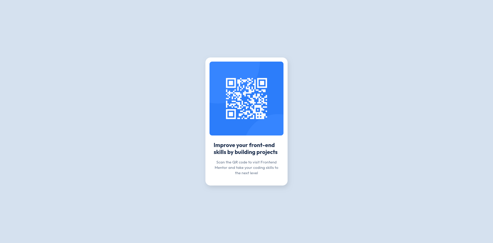

# Frontend Mentor - QR code component solution

This is a solution to the [QR code component challenge on Frontend Mentor](https://www.frontendmentor.io/challenges/qr-code-component-iux_sIO_H). Frontend Mentor challenges help you improve your coding skills by building realistic projects. 

## Table of contents

- [Overview](#overview)
  - [Screenshot](#screenshot)
  - [Links](#links)
- [Author](#author)

## Overview

### Screenshot

### Links

- Solution URL: [link](https://github.com/Tserewara/qr-code-component)
- Live Site URL: [link](https://tserewara.github.io/qr-code-component/)

## My process

### Built with

- HTML5
- CSS custom properties
- Flexbox

## Author

- Website - [Álvaro Junqueira](https://alvarojunqueira.com.br)
- Frontend Mentor - [@Tserewara](https://www.frontendmentor.io/profile/Tserewara)
